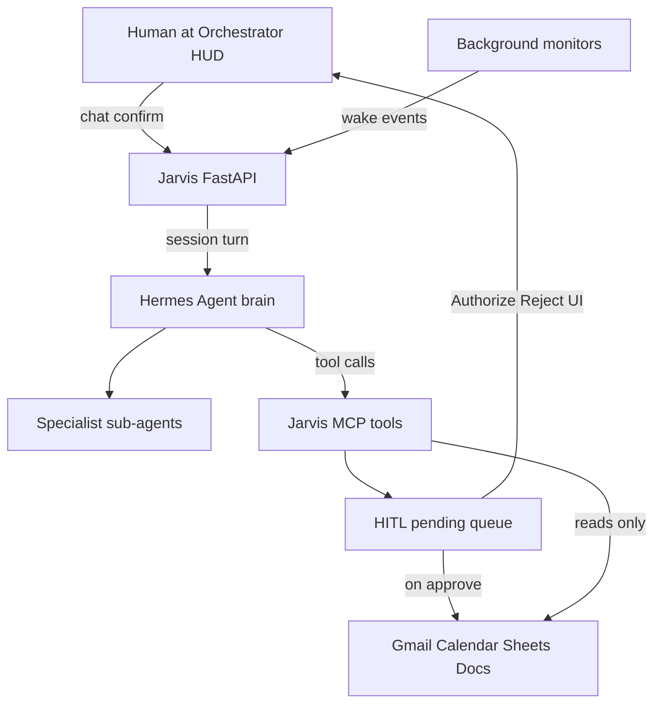

# Jarvis Foundation: Hermes Brain + Ops Control Plane

> **Status:** F0–F2 implemented and tested (33 pytest passed including live Hermes E2E). F3–F5 paused for manual browser verification.

## Decisions locked

- **Brain:** Hermes Agent is the primary cognitive orchestrator (routes tools/sub-agents, holds persona/memory/skills). This is the stronger long-term path: we reuse Hermes bots/delegation/skills/cron instead of re-implementing routing in FastAPI.
- **Control plane:** Jarvis FastAPI owns domain connectors, the HITL queue, background monitors, and the Orchestrator HUD contract.
- **Always-on (v1):** Chat + HITL when at the HUD **plus** background monitors (unread mail / shop signals) that can wake Jarvis and enqueue approvals—not full interrupt-heavy daemon/messaging gateways yet.
- **Phase 1 done:** Orchestrator UI is live; Hermes CLI chat is verified working (NVIDIA NIM).

---

## North-star roles (foundation, not special features)

| Role                 | Responsibility                                                                                                                          |
| -------------------- | --------------------------------------------------------------------------------------------------------------------------------------- |
| **Jarvis (persona)** | One voice: candid personal companion + sharp ops manager. Defined in Hermes SOUL / project context.                                     |
| **Hermes brain**     | Understand intent, plan multi-step work, invoke tools/sub-agents in order.                                                              |
| **Sub-agents**       | Specialists (Mail, Research, Data/Shop, Ops/Write, Docs/Reports)—start as Hermes skills + delegated sessions mapped to orchestra nodes. |
| **Jarvis tools**     | Real world I/O via MCP: mail, calendar, sheets, shop read, local docs/reports.                                                          |
| **HITL**             | Any external write (send mail, create event, write sheet, promote CNC, outbound deploy) queues Authorize/Reject—never silent.           |
| **Monitors**         | Cheap/local-ish polling: unread/critical mail, shop glance signals → activity stream + optional Hermes wake or pending.                 |

Special features (later phases) plug into this spine: new MCP tools, new skills/bots, new monitors—without rewriting the brain.

---

## Phase F0 — Contracts and persona (thin, first)

Define stable interfaces before wiring Hermes deeply.

- **Session contract:** extend `ChatResponse` / pending with `agent_id`, `activity[]`, `wake_reason` so the HUD orchestra/stream stay driven by facts not heuristics alone (`[frontend/src/lib/types.ts](frontend/src/lib/types.ts)`, `[backend/app/schemas.py](backend/app/schemas.py)`).
- **Persona pack:** Hermes `SOUL.md` + Jarvis project context (ops firm + personal assistant boundaries): candid life talk OK; shop writes always HITL; never invent shop numbers.
- **Agent map (fixed for foundation):**

| Node     | Code   | Domain                                     |
| -------- | ------ | ------------------------------------------ |
| Research | RES.01 | web/brief synthesis                        |
| Mail     | SEC.02 | inbox read / attachment triage             |
| Data     | DAT.03 | shop sheets, local data, inspection drafts |
| Ops      | OPS.04 | outbound mail, calendar, sheet writes, CNC |

---

## Phase F1 — Jarvis MCP tool server + HITL interceptor

Expose existing handlers as MCP tools Hermes can call; block side effects behind HITL.

- New package `[backend/app/hermes/](backend/app/hermes/)`: `mcp_server.py`, `hitl.py` (`request_human_approval`), `bridge.py` (turn adapter).
- Adapt `[backend/app/tools/registry.py](backend/app/tools/registry.py)`: reads execute; writes call `request_human_approval` → `[db.add_pending](backend/app/db.py)` → return queued payload to Hermes.
- Keep `[resolve_pending](backend/app/agent.py)` as the only path that runs connectors after Authorize.
- Register MCP in Hermes config (`mcp_servers` → Jarvis stdio/HTTP). FastAPI lifespan starts/stops MCP as needed.
- Wire Orchestrator `[HitlModal](frontend/src/components/orchestrator/HitlModal.tsx)` to enriched pending (`agent_id`, tool name)—already UI-ready.

**Invariant:** Hermes never holds Gmail/Sheets write credentials for silent use; Jarvis MCP is the gate.

---

## Phase F2 — Hermes brain replaces FastAPI agent loop

- Replace `_run_agent` core in `[backend/app/agent.py](backend/app/agent.py)` with `hermes/bridge.py`: user message (+ optional wake context) → Hermes turn → map speak/tools/pending/activity into `ChatResponse`.
- Keep `/api/chat`, `/api/confirm`, `/api/pending` so the Orchestrator stays thin (`[backend/app/main.py](backend/app/main.py)`).
- Demote `[intent.py](backend/app/intent.py)` heuristics (optional allowlist guard only).
- Hermes uses installed provider (current NVIDIA NIM) for reasoning; Jarvis may still use lighter paths for monitors (see F3).

**Conversation modes:** one Hermes session/profile for Jarvis; persona handles personal vs ops in-band (no separate apps). Sub-agents are delegated work, not separate HUD apps.

---

## Phase F3 — Background monitors (always-on v1)

- Monitor workers (extend `[snapshot.py](backend/app/snapshot.py)` / `[jobs.py](backend/app/jobs.py)` / glance):
  - Unread / critical mail signals
  - Shop/OEE or bound-sheet health signals (read-only)
- Emit **wake events** into session activity + optional Hermes “nudge” turn when severity warrants (otherwise HUD stream only).
- Monitors use **cheap/local or non-Hermes** classification where possible; escalate to Hermes only when a plan or draft is needed.
- API: `GET /api/activity`, `GET /api/agents` for live orchestra/stream (`[OrchestratorShell](frontend/src/components/orchestrator/OrchestratorShell.tsx)`).

No Telegram/Discord gateway in foundation; HUD is the interrupt surface.

---

## Phase F4 — Sub-agent scaffolding (multi-agent ready)

- Hermes skills under `skills/jarvis/{mail,research,shop,ops,docs}/SKILL.md` describing when to load and which MCP tools to use.
- Map delegation/bot ids → orchestra nodes so the HUD shows which specialist is working.
- Document how later special features add a skill + MCP tool + optional monitor without touching the brain.

---

## Phase F5 — Hardening

- Tests: HITL blocks writes; MCP tool round-trip; chat via bridge; monitor wake → activity; confirm executes connector.
- Config: `[.env.example](.env.example)` / `[config.py](backend/app/config.py)` for Hermes home, MCP endpoint, monitor intervals.
- Cut over: remove reliance on old `_try_model_route` for primary chat; keep connectors.

---

## Explicit non-goals (this foundation)

- Messaging platforms (Telegram etc.)
- Full interrupt UX beyond HUD pending + activity
- Rewriting Google OAuth from scratch
- Pixel-perfect special features (inspection productization, CNC machine control, etc.)—those land as later plugins on this spine

---

## Suggested build order

1. F0 contracts + persona
2. F1 MCP + HITL (safe tool surface)
3. F2 Hermes bridge (brain online in HUD)
4. F3 monitors
5. F4 sub-agent skills
6. F5 tests/cutover

After F2 you already have “Jarvis talks via Hermes and can queue Authorize.” F3–F4 make it 24/7 and multi-agent.