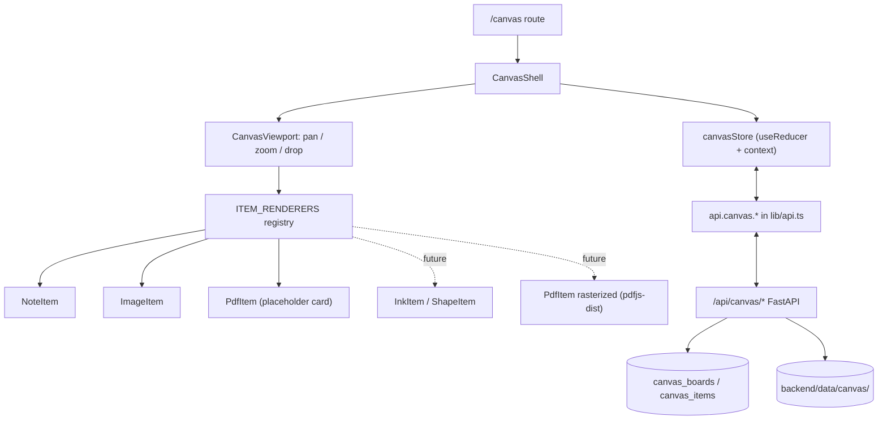

# Canvas Mode Scaffold

## Assessment of the plan

Good fit, and more of it exists than you might think. [frontend/src/components/HudShell.tsx](frontend/src/components/HudShell.tsx) already does full-page drag-and-drop (`onDrop` at line 450), the backend already stores and serves binary files (`POST /api/inbox`, `GET /api/artifacts/{id}` in [backend/app/main.py](backend/app/main.py)), and the design language (`.hud-bg`, `.glass`, `cyan`/`amber`) is established.

One adjustment to the "scaffold now, build later" framing: an empty shell tends to get thrown away. This plan scaffolds a *working* viewport (pan, zoom, place, move, resize, persist) so that future work is adding item types, not building the engine.

No canvas library, and for this pass, no new dependencies at all. With freehand drawing off the table, tldraw and Excalidraw would bring a large dependency and their own opinionated shell just to give us CSS transforms we can write in ~80 lines, and they'd fight the HUD aesthetic. `pdfjs-dist` (for rasterizing PDF pages) is deferred to a later pass so we never touch `package-lock.json` while other agents are working.

## Working alongside other agents

Other agents are active in this project and none of them are on the canvas. Two facts drive the sequencing:

- There is no git repository, so no agent currently has a rollback point.
- A uvicorn `--reload` backend (pid 18156) and `npm run dev` (pids 15000, 12300) have been running for hours, and the terminal history shows other agents running 40-90 second regression scripts against `http://127.0.0.1:8000`. Saving a backend file restarts uvicorn and drops their in-flight requests.

Mitigations, all folded into the phases below:

- Phase 0 is `git init` plus one initial commit. `.gitignore` already excludes `.env`, `.venv/`, `backend/data/`, and `node_modules/`, so this is safe and benefits every agent, not just this task.
- Phases 1-4 create new files only, under `lib/canvas/`, `components/canvas/`, and `app/canvas/`. Zero shared files, zero server restarts beyond Next.js picking up a new route.
- Phase 5 is a single short batched pass over the five shared files, so the backend restarts once instead of repeatedly.
- No edit to [frontend/src/components/HudShell.tsx](frontend/src/components/HudShell.tsx). It is the highest-traffic file in the project. The board is reachable at `localhost:3000/canvas` directly; the header link is a two-line change to make later once other HUD work settles.
- No `npm install`, so `package-lock.json` is untouched.

The new SQLite tables are `CREATE TABLE IF NOT EXISTS` additions inside the existing `init_db()`, and nothing in this plan reads or writes another feature's tables.

## Architecture




## Backend

Extend [backend/app/config.py](backend/app/config.py) with `canvas_dir: Path = ROOT / "data" / "canvas"` and mkdir it alongside `exports_dir`.

Two tables in the `init_db()` script in [backend/app/db.py](backend/app/db.py):

```sql
CREATE TABLE IF NOT EXISTS canvas_boards (
    id TEXT PRIMARY KEY,
    name TEXT NOT NULL,
    camera TEXT NOT NULL,        -- json {x, y, z}
    created_at TEXT NOT NULL,
    updated_at TEXT NOT NULL
);
CREATE TABLE IF NOT EXISTS canvas_items (
    id TEXT PRIMARY KEY,
    board_id TEXT NOT NULL,
    kind TEXT NOT NULL,          -- note | image | pdf  (open for future kinds)
    x REAL, y REAL, w REAL, h REAL,
    rotation REAL NOT NULL DEFAULT 0,
    z INTEGER NOT NULL DEFAULT 0,
    data TEXT NOT NULL,          -- json, kind-specific
    created_at TEXT NOT NULL,
    updated_at TEXT NOT NULL
);
```

Geometry gets real columns (queryable, future viewport culling); everything kind-specific lives in `data` so a new item type needs no migration.

Endpoints in [backend/app/main.py](backend/app/main.py), with `CanvasBoard`/`CanvasItem`/`CanvasCamera` models added to [backend/app/schemas.py](backend/app/schemas.py):

- `GET /api/canvas/boards` and `POST /api/canvas/boards` - list / create.
- `GET /api/canvas/boards/{id}` - board plus its items.
- `PUT /api/canvas/boards/{id}` - bulk replace items and camera. Single-user local app on a debounced save, so bulk replace beats per-item PATCH churn; per-item routes can be added later without changing the client contract.
- `POST /api/canvas/files` - multipart upload to `canvas_dir`, returns `{file_id, name, mime, width, height, page_count}`. Uses `pypdf` (already in [backend/requirements.txt](backend/requirements.txt), so no new dependency) to read page count and first-page size for PDFs, so the item spawns at the correct aspect ratio.
- `GET /api/canvas/files/{file_id}` - `FileResponse`, reusing the path-containment guard from `api_artifact_download` (lines 104-114) so uploads can't escape `canvas_dir`.

Agent seam, not wired yet: item creation funnels through a single `db.add_canvas_item(...)`. A future `add_to_canvas` tool in [backend/app/tools/registry.py](backend/app/tools/registry.py) calls that one function; nothing else needs to change.

## Frontend

New files under `frontend/src/`:

- `lib/canvas/types.ts` - the seam. Base geometry plus a discriminated union:

```ts
type CanvasItemBase = { id: string; x: number; y: number; w: number; h: number; rotation: number; z: number };
export type NoteItem  = CanvasItemBase & { kind: "note";  text: string; color: NoteColor };
export type ImageItem = CanvasItemBase & { kind: "image"; fileId: string; naturalW: number; naturalH: number };
export type PdfItem   = CanvasItemBase & { kind: "pdf";   fileId: string; page: number; pageCount: number };
export type CanvasItem = NoteItem | ImageItem | PdfItem;
```

- `lib/canvas/camera.ts` - `{x, y, z}` plus `screenToWorld` / `worldToScreen`. Every pointer handler converts once at the top; nothing downstream thinks in screen pixels.
- `lib/canvas/store.ts` - `useReducer` + context (no new state dependency). Actions: `addItem`, `moveItem`, `resizeItem`, `updateItem`, `deleteItem`, `select`, `setCamera`. A debounced effect (~600ms) pushes to `PUT /api/canvas/boards/{id}`.
- `components/canvas/CanvasViewport.tsx` - one absolutely-positioned world layer with `transform: translate(x,y) scale(z)` and `will-change: transform`. Wheel zooms toward the cursor (clamped ~0.05x to 8x), ctrl/cmd+wheel and trackpad pinch map to the same path, drag on empty space or middle-mouse pans. Items render as DOM children, so text stays crisp and selection/editing is free.
- `components/canvas/items/` - `NoteCard.tsx`, `ImageCard.tsx`, `PdfCard.tsx`, plus `index.ts` exporting `ITEM_RENDERERS: Record<CanvasItem["kind"], ComponentType<ItemProps>>`. Adding an item type later = one file + one registry line.
- `components/canvas/CanvasBackground.tsx` - dot grid that scales with zoom, matching the `.hud-bg` palette.
- `components/canvas/SelectionFrame.tsx` - selection outline and corner resize handles, drawn in screen space so handles stay a constant size at any zoom.
- `components/canvas/CanvasShell.tsx` - toolbar (add note, fit-to-content, zoom readout, back to HUD), keyboard handlers (Delete, Escape, `0` reset zoom, `1` zoom to fit), and the drop target.
- `app/canvas/page.tsx` - renders `<CanvasShell />`.

Wiring (phase 5): add a `canvas` object to the exported `api` in [frontend/src/lib/api.ts](frontend/src/lib/api.ts) following the existing `json<T>()` and `uploadInbox` patterns. A separate route deliberately keeps the HUD's page-level `onDrop` (which forwards files to the agent) from competing with the canvas drop handler, and means no edit to `HudShell.tsx`.

PDFs, this pass: dropping a PDF uploads and persists it and creates a real `PdfItem` at the true page aspect ratio (page size comes from `pypdf` on the backend, which is already a dependency). `PdfCard` renders a HUD-styled placeholder - filename, page count, page dimensions, click to open the file. Rasterization via `pdfjs-dist` is a later pass that swaps only the inside of `PdfCard`; the item model, upload path, and geometry are already correct, so nothing else changes.

## What "done" means for this scaffold

Open `/canvas`, pan and zoom smoothly over a large empty board, drop a PNG and see it land under the cursor at correct aspect ratio, drop a PDF and get a correctly-proportioned placeholder card, double-click empty space for a sticky note, drag/resize/delete items, reload the page and find everything where you left it. No other agent's work is disturbed.

## Explicitly out of scope

PDF page rasterization and multi-page navigation (deferred with `pdfjs-dist`), freehand ink, shapes and connectors, multi-select and grouping, undo/redo, agent tools, the HUD header link, and multi-board management UI beyond a single default board. The item union, the renderer registry, and the `data` JSON column are the seams that make each of these additive.

## Build order

1. `git init` plus initial commit. Rollback point for everyone.
2. Model layer: `lib/canvas/types.ts`, `camera.ts`, `store.ts`. New files.
3. Viewport: `CanvasViewport.tsx`, `CanvasBackground.tsx`, `SelectionFrame.tsx`. New files.
4. Items: `NoteCard`, `ImageCard`, `PdfCard`, registry `index.ts`. New files.
5. Shell and route: `CanvasShell.tsx`, `app/canvas/page.tsx`. New files. At this point the board runs against in-memory state.
6. Integration, one batched pass: `config.py`, `schemas.py`, `db.py`, `main.py`, `lib/api.ts`. This is the only step that touches shared files or restarts the backend.
7. Docs.

Steps 2-5 are safe to run at any time. Step 6 is worth a heads-up to the other agents, since it restarts uvicorn once.

## Docs

Add a Canvas section to [docs/AS_BUILT.md](docs/AS_BUILT.md) (surfaces, endpoints, storage location) and move the deferred items into its existing "Not built" list. `AS_BUILT.md` is a file other agents also edit, so this goes last as an append rather than a rewrite.