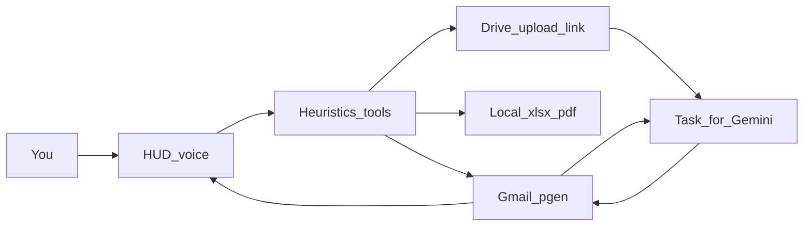

# Hands, Gmail, and Gemini Spark

Ollama warmth stays parked. This upgrade is **hands**, not a smarter local model.

Jarvis remains the HUD, voice, familiarity, and Shall I. It sends as **pgeneration.mech@gmail.com**. It still makes local xlsx/docx/pdf under `backend/exports`. When the job needs PDF/image analysis, a Drive file, or a long composed reply, Jarvis writes a **Task for Gemini** email and waits for the thread reply. Gemini does not replace ordinary mail, briefing, or “make a pricing sheet.”

## What is already there

- [backend/app/tools/registry.py](backend/app/tools/registry.py) drafts, queues **Shall I**, lists calendar, writes local xlsx/docx/pdf, reviews dropped **text**.
- [backend/app/connectors/email.py](backend/app/connectors/email.py) can **IMAP-read** if keyed. **Send always writes a local SENT row** — [resolve_pending](backend/app/agent.py) calls `send_email` and never SMTP/Gmail.
- Demo inbox stays the fallback when Google is not signed in.
- Dropped images/scans already fail honestly (“no readable text”). That is the Gemini handoff, not a local vision project.

## Google identity (one consent)

One OAuth client for `pgeneration.mech@gmail.com`. Scopes:

- `gmail.send` + `gmail.readonly` — real send, live inbox, same-thread replies
- `drive.file` — upload Jarvis exports, create a file, return a **webViewLink** or find by **exact title**

Store the refresh token outside git (e.g. `backend/data/google_token.json`). Add a small “Connect Gmail” step (local loopback or one-time paste). Keep `EMAIL_BACKEND=local` until the token exists.

Do **not** start with IMAP/SMTP-only. Spark file jobs need Drive links; a second auth later is wasted work. App-password IMAP can stay as a documented fallback if OAuth is blocked.

Need one config fact from you when we build: **To:** address Spark actually watches. Default: send **to self** (`pgeneration.mech@gmail.com`) so From + subject match the filter. If Spark is a different inbox, set `GEMINI_TASK_TO`.

## Phase 1 — Real mail

Wire confirm to Gmail, not SQLite-only.

- On Shall I yes: Gmail API send (plain reply or new message). Mirror the message into local `emails` so familiarity still works.
- Read: live INBOX (and SENT) instead of demo when connected. Keep demo people only for offline.
- Thread id on drafts so “reply to her” is a real thread, not a fake `in_reply_to` string.
- Speak and Shall I stay as they are. Failed send speaks once: “Gmail did not take it.”

Files: [backend/app/connectors/email.py](backend/app/connectors/email.py), [backend/app/agent.py](backend/app/agent.py) `resolve_pending`, [backend/app/config.py](backend/app/config.py), `.env.example`.

## Phase 2 — Drive as the file bridge

Gemini cannot see Gmail attachments. Every file job that leaves the machine must land on Drive first.

New tools (heuristic, skip the 1B model):

- `drive_upload` — last artifact or a named export → Drive → remember `link` + `title` on the working set
- `drive_find` — exact title → link, or ask once if two match

Local `create_spreadsheet` / `create_pdf` stay. After make: optional “put it on Drive.” Speak: “The pricing sheet is on Drive.” Board shows the link.

## Phase 3 — Task for Gemini

New tool `task_for_gemini`. This is a **mail send** with a rigid envelope, not a chat to Gemini.

Envelope (hard rules, match your Spark task):

- From: `pgeneration.mech@gmail.com`
- To: `GEMINI_TASK_TO` (default self)
- Subject: exactly `Task for Gemini` — never `Re:`
- Body always has three blocks:
  1. **File:** Drive link, or exact Drive title (from working set / `drive_find`)
  2. **Do this:** numbered extract / calculate / analyze steps
  3. **Reply like this:** the exact reply shape

Shall I shows those three blocks. Yes sends. Jarvis then **polls that thread** (Gmail, every ~20s, timeout ~3 min) and when Gemini replies: speak a short fact line, put the body on the board, store the thread in familiarity.

If the user asked for file analysis and there is no Drive link or title, **ask once** — do not send a Task. If they only wanted a local sheet, do not call Spark.

Heuristics (work path, no model):

- “Ask Gemini…”, “send this to Gemini”, “analyze this PDF/image”, “read the Drive file…”
- File analysis + last Drive artifact → fill the three blocks from the spoken ask; if the reply format is missing, use a default: short facts + a table if numbers

## Phase 4 — Spreadsheet and image (what “actual” means)

**Spreadsheet**

- Keep local xlsx (already real files). Improve later: open in Excel (`os.startfile`), richer columns from the ask — still heuristic.
- “Share it / put it on Drive / have Gemini fill it” → upload + Task, not a second local blank.
- Full Google Sheets API (live cells in the browser) is **later**, not this pass.

**Image**

- Jarvis does **not** generate or see pixels in this pass (no local image model, no vision).
- Path: file already on Drive, or user drops a file → we upload → Task for Gemini with steps + reply format.
- Dropped image with no Task intent: keep the honest “I cannot read that here. Shall I send it to Gemini?”

## Other tools worth adding (after the above)

Do these only once mail + Drive + Spark close the loop.

- **Open local artifact** — Excel/Word/PDF via the OS, so “actual spreadsheet” is on screen.
- **Glance for Gemini** — if a watched Task thread gets a reply while idle, one whisper (same glance machinery).
- **Google Calendar write** — same OAuth, extra scope later; Shall I stays. Local calendar remains fallback.
- **Name → address** — Gmail contacts or a tiny local alias list so “mail Priya” works on the real inbox.

Do **not** add this pass: WhatsApp, smart home, RAG, desktop wrap, local image generation, SMTP-only dead end.

## Safety (unchanged shape)

| Action | Gate |
| --- | --- |
| Read inbox, draft, local file, Drive find | Free |
| Gmail send (human reply or Task for Gemini) | Shall I |
| Drive upload of a new file | Shall I if sharing beyond the account; upload-to-own-Drive can be free |
| Calendar write (later) | Shall I |

Tokens and client secrets only in `.env` / `backend/data`. Never in the HUD.

## Build order

1. OAuth + real send + live read (demo fallback)
2. Drive upload / find + working-set link
3. `task_for_gemini` composer + thread poll
4. Open-local-file + “I cannot read that; Shall I send it to Gemini?”
5. Docs via **documentation-ocd** in the background (`composer-2.5-fast`) after the loop works

Success: you say “make a pricing sheet” and get a local xlsx; you say “put it on Drive and ask Gemini for a variance table” and one Shall I sends `Task for Gemini` with link, steps, and reply format; Gemini’s reply lands on the board without a second compose.
