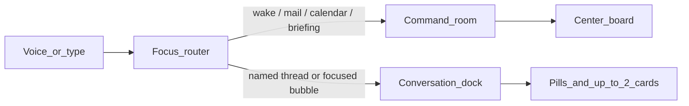

# HUD conversations (command room + dock)

The center stays what it is today: glance, whisper, one-shot work (mail, calendar, briefing), composer, orb. Long-running chats live on the **right** as a dock, not as a second fullscreen.

This is the next product layer. A full Files/Drive redo waits. **Open from Drive** is only a spawn path into a conversation, not a Drive browser.

## What exists today

- One HUD page, one `session_id` (`default`) in `[frontend/src/lib/api.ts](frontend/src/lib/api.ts)`. Chat, pending, working set, thoughts, and watch all key off that id.
- Center board is a single `scene` in `[HudShell.tsx](frontend/src/components/HudShell.tsx)`. Shall I is one global `[ConfirmBar](frontend/src/components/ConfirmBar.tsx)`.
- SQLite already stores `messages` and `working_set` per `session_id` (`[backend/app/db.py](backend/app/db.py)`). There is no conversations list, title, category, or min/max state.
- Drawing viewer is a HUD overlay (`[DrawingViewer.tsx](frontend/src/components/DrawingViewer.tsx)`), local files only. Drive find/upload exists but does not open the viewer.
- Command brain is `gemini-3.6-flash` ([`backend/app/config.py`](backend/app/config.py)). Google lists PDF and image as inputs for that model. Mail vision already tries `inline_data` then falls back to `pypdf` text ([`think.py`](backend/app/think.py) `_vision_notes`). The old “this key will not take PDF as vision” note was for 2.5 Flash and is stale.

## Product rules (agreed)

- **Center = command room.** Briefing, mail, calendar, glance stay there. They do not open a bubble unless you later say to keep talking about that work.
- **Right dock = extra threads.** A drawing, a stuck mail thread, a research job. Grouped by category (Drawings, Mail, Research, Files).
- **At most two expanded.** The rest are pills. Voice can swap which two are open.
- **Do not clutter.** Dock is a slim column. Expanded cards are compact (short transcript + a small board). The center board stays visible. No stack of overlapping OS windows.
- **Shall I for a thread stays in that card.** Global confirm bar is for command-room pending only, so a drawing chat cannot trap “check my mail”.
- **One brain turn at a time.** Gemini/tools serialize. Other windows can wait with a quiet “working” mark. Parallel model calls would fight the HUD and the API key.

## Conversation model

Add a `conversations` table (id, session_id, category, title, focus JSON, minimized, updated_at). Each row is a real agent session: same `run_agent(message, session_id=…)` path, own working set, own pending, own messages.

Categories are assigned at spawn, not a folder UI:

- `drawing` — viewer / Drive file
- `mail` — later peel-off (not this first slice)
- `research` — later
- `files` — local sheet/doc later

HUD loads the list on startup. Reload restores pills. Cap stored threads (about 12); oldest idle ones archive, they do not fill the dock.

## Dock UI

Right edge of the HUD, above the footer, pointer-events only on the column:

- **Collapsed:** category stacks of pills (title + waiting dot if Shall I or busy).
- **Expanded (max two):** card with title, mini transcript, compact scene widgets (table/timeline/markdown scaled down), composer line or “speak to this”, min button.
- Click pill to expand (if two already open, the oldest expanded collapses).
- Voice: “minimize the drawing”, “open the piston chat”, “hide conversations”, “show the drawing window”.

Command composer and orb stay in the footer. They talk to the **command** session unless a bubble is focused (clicked, or just addressed by name).

## Voice routing

Today every utterance hits `default` unless the viewer intercepts zoom/close (`[HudShell.tsx](frontend/src/components/HudShell.tsx)` around the viewer voice branch).

New order:

1. Viewer chrome (zoom, page, close) while the overlay is open — unchanged.
2. Window chrome: minimize / maximize / hide dock — HUD, not the brain.
3. If command-room Shall I is up, yes/no goes there.
4. Else if a focused conversation has Shall I, yes/no goes there.
5. Else if the line names a thread (“in the drawing”, “the piston chat”), route to that session.
6. Else command room.

Wake word still means command unless (5) or a bubble holds focus.

## Drawing spawn (first real fixture)

This is the first conversation you can feel, and it ties Files/Drive just enough:

1. “Open the piston PDF” / “open this from Drive” (after it is local, same as today’s viewer rule).
2. Viewer opens over the HUD as now.
3. Jarvis asks: **Shall I keep a conversation on this drawing?**
4. No → overlay only. Yes → create a `drawing` conversation, dock a card, start priming.

**Prime while the card opens** (does not wait for the next user line):

- Create session + working set (file id, local path, Drive link, title).
- Send the **drawing itself** to Gemini, not only extracted text. Engineering PDFs often have no useful OCR; Tony needs to talk about views, dimensions, and notes that are on the sheet.
- Warm with a thread system prompt: this file is the focus; do not invent geometry; say when a number is unreadable; ask what they want next. Store a short ready speak (“The piston drawing is in focus.”) plus a private grounding note (title block, views, what is actually visible).
- Card shows a warming state, then ready.

**Vision policy (drawing conversations only)**

Command room stays on `gemini-3.6-flash`. Drawing threads try Flash first as native multimodal (PDF `application/pdf`, or page images). Prefer the Files API when the file will be reused across turns, so later questions still see the sheet instead of a stale summary.

Fallback, in order, only if Flash cannot actually see the drawing (HTTP 4xx on the media, empty/refusal, or a grounding note that is clearly text-extraction-only on a CAD PDF):

1. Retry the same payload on **Pro** (`GEMINI_DRAWING_MODEL`, default `gemini-3.1-pro` — confirm the live model id against `/models` at implement time). Pro is **only** for that drawing session, not mail/calendar/briefing.
2. If native PDF is rejected, rasterize the current viewer page(s) to PNG and send those as images (Flash, then Pro).
3. `pypdf` text is a last-ditch caption, never the primary understanding of a drawing.

Do not invent dimensions. If the model cannot read a number, it says so.

Follow-up turns in that session keep the file (or Files API uri) on the request, and can use tools (save marked PNG, Drive upload, draft a reply with the drawing — if already built — research, etc.). Tool **scene** renders **inside the card**, not on the center board. If a tool needs a big surface (viewer), it reopens the overlay; the thread stays the home for talk.

Drive **list/search of the whole Drive** is out of this pass. Scope is still `drive.file`. “Open from Drive” means a file Jarvis already knows (saved attachment, last upload, or `drive_find` by exact title).

## What a conversation card must hold

Each turn may: speak, compact scene, attachments, Shall I, “more” thoughts. Reuse `ChatResponse` per session. The card is a small HUD, not a Slack clone: last few lines + current board + pending strip. Full history on expand-scroll, not a wall of text in the room.

## Out of scope (this layer)

- Peeling mail/calendar/research into threads (the spawn hook can exist; do not auto-open a bubble for “check my mail”).
- Canvas, diarize, Task-for-Gemini email handoff.
- Raising Drive OAuth to full `drive.readonly`.
- Free-dragging windows around the HUD.

## Suggested build order

1. Data + API: list/create/focus/minimize conversations; `run_agent` already takes `session_id`.
2. Dock UI: pills, two expanded cards, click min/max, restore on reload.
3. Voice chrome + focus router in HudShell.
4. Drawing: viewer ask → spawn → prime → tools stay in the card.

No implementation until this plan is accepted.