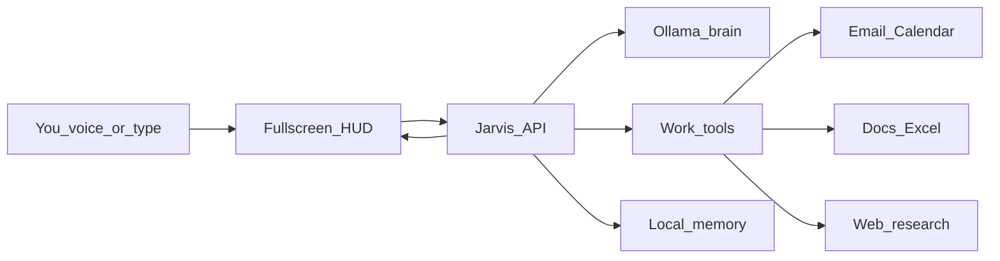

# Jarvis Command Center

## What I think of the plan

The movie vision is the right product target: stand in front of a large screen, speak, and get a living workspace back — not a chatbot in a box.

Ollama should **not** “do all of this.” Ollama is the brain. Jarvis needs four other parts or it will feel like a chat window with extra steps:

- **Ears / voice**: speech-to-text and text-to-speech
- **Hands**: tools that actually send mail, write `.xlsx` / `.docx`, search the web
- **Face**: a fullscreen HUD that can render dashboards, tables, and documents
- **Judgment**: confirm-before-act, memory, and an audit log

Hybrid is the correct v1: keep thinking local, use cloud only where APIs are unavoidable (Gmail / Outlook, calendar, web search). Local models are weaker at long multi-step tool use than frontier APIs, so v1 should give the model a **small, strict tool set** and make the UI do the beauty work.

[`D:\Cursor\Jarvis`](D:\Cursor\Jarvis) is empty. This is a greenfield build.

## Recommended product shape

Treat Jarvis as a **command center**, not a single agent process.



**UI contract (the “Jarvis feel”):** the model does not draw pixels. It returns structured **scene cards** (KPIs, charts, tables, timelines, markdown, file artifacts). The HUD renders them.

Example scene payload:

```json
{
  "speak": "You have 3 unread client emails and a 4pm review.",
  "scene": {
    "title": "Afternoon briefing",
    "widgets": [
      { "type": "kpi", "label": "Unread", "value": 3 },
      { "type": "table", "columns": ["From", "Subject"], "rows": [] },
      { "type": "timeline", "items": [] }
    ]
  },
  "artifacts": [{ "kind": "xlsx", "path": "exports/weekly.xlsx" }]
}
```

## Features to add (in this order)

### Must-have for it to feel like Jarvis

- Push-to-talk and always-on listen (wake word later)
- Spoken replies plus on-screen explanation
- Fullscreen cinematic HUD (dark glass, large type, live widgets)
- Confirm-before-act for send / delete / calendar changes
- Session memory (“that spreadsheet”, “the client from this morning”)
- Artifact tray: generated Excel, Word, PDF files you can open or download
- Activity log: what Jarvis read, drafted, and did

### Work-ops v1 (your chosen focus)

- **Daily briefing**: unread mail, today’s calendar, open tasks
- **Email**: search, summarize threads, draft replies; send only after you confirm
- **Calendar**: show the day/week, create/move events with confirmation
- **Documents**: Word summaries, meeting notes, one-pagers
- **Excel**: tables from chat, CSV import, simple analysis sheets, charts
- **Research**: web search + cited briefing cards (not raw link dumps)
- **File inbox**: drop a PDF / spreadsheet and ask questions about it

### Customization (do early, keep small)

- Name, voice, verbosity, and persona
- Work profile: timezone, job context, preferred sign-off
- Theme / HUD density for a TV or monitor wall
- Skill toggles: enable email, calendar, files independently
- Approval rules: auto-draft vs ask every time

### Add later (after v1 is reliable)

- Wake word (“Jarvis”)
- Proactive briefings on a timer
- Multi-skill plans (“research this, then make a deck and mail it”)
- Vision: look at the screen or a document photo
- Local RAG over your folders
- Phone / second-screen companion
- Smart home, music, system control

### Do not start with

- A 40-tool “do everything” agent
- Unattended email send
- Full desktop control / arbitrary shell
- Trying to make one Ollama model also do STT, TTS, and pixel-perfect UI

## Suggested stack

| Layer | Choice | Why |
|---|---|---|
| Face | Next.js + Tailwind fullscreen HUD | Huge-screen dashboards, easy to iterate |
| API | Python FastAPI | Best fit for Ollama, docs, Excel, Whisper later |
| Brain | Ollama chat + tool calling | Local reasoning; swap models without rewriting the app |
| Memory | SQLite | Sessions, approvals, artifacts, preferences |
| Voice v1 | Browser speech APIs | Fast to ship on Windows; upgrade to Whisper + Piper later |
| Docs | `python-docx` + `openpyxl` | Real `.docx` / `.xlsx` files |
| Email / calendar | Microsoft Graph **or** Gmail + Google Calendar | Hybrid adapters behind one interface |
| Research | Brave / Tavily (cloud) | Grounded search without training the model on the live web |

Default local model: a tool-calling 7B–14B instruct model (for example Qwen2.5 or Llama 3.1). Keep a cloud-model fallback later if local tool-calling is too brittle.

## Build phases

### Phase 1 — Face and brain

Scaffold the empty repo: FastAPI + Next.js HUD, typed chat, Ollama health check, scene-card renderer (KPI, table, markdown, chart). Typed chat must already look like a command center, not a generic chat app.

### Phase 2 — Voice loop

Mic button, transcript in the HUD, spoken `speak` field, barge-in / cancel. Same agent path as typing.

### Phase 3 — Artifacts

Tools: `create_spreadsheet`, `create_document`, `create_pdf`. Files land in an `exports/` tray and appear as HUD cards.

### Phase 4 — Work connectors

One email provider and one calendar provider first. Read + draft + confirm. Then research search with citations.

### Phase 5 — Memory and briefing

Preferences, short-term session memory, morning/afternoon briefing scene.

## Safety rules from day one

- Drafts are free; sends and calendar writes need an on-screen confirm
- File writes only inside a workspace folder
- Secrets in `.env`, never in the model prompt
- Every tool call written to an audit table

## What “done” looks like for v1

You can stand at a large monitor, say *“Jarvis, brief me on this afternoon and draft a reply to the last client email”*, see a briefing dashboard, hear a short spoken summary, edit the draft, confirm send, and export a follow-up spreadsheet.