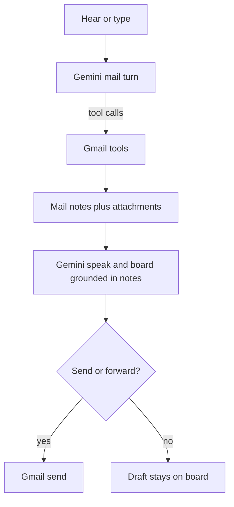

# Mail aspect (Gemini + live Gmail)

Same contract as research: **tools own truth**, Gemini chooses tools and writes voice/board, heuristics are the fallback if the model misses. Mail turns must stop skipping the brain ([`backend/app/agent.py`](backend/app/agent.py) currently `raise OllamaError("skip model tools")` for all work except the research special-case).

Live fixture: Tony’s recent Gmail on `pgeneration.mech@gmail.com`. We will not send unless you confirm Shall I.

## What exists today

- Live Gmail via [`backend/app/connectors/gmail.py`](backend/app/connectors/gmail.py) (list/search/read/send). SQLite cache in [`backend/app/connectors/email.py`](backend/app/connectors/email.py).
- Phrase routing and “that / her / Muskaan” in [`backend/app/agent.py`](backend/app/agent.py) `_heuristic_tools` + [`backend/app/familiarity.py`](backend/app/familiarity.py).
- Inbox board is a From/Subject/When table. Read dumps body widgets. Speak is extractive (`speak_mail`). Reply body is a template (`reply_draft` in [`backend/app/compose.py`](backend/app/compose.py): “Thank you for the note… I will follow up”).
- Send is Shall I (`draft_email` queues `email_send`). **No forward, no attachments, no compose-new that is not a reply, no vision.** Body truncated to 4000 chars. `In-Reply-To` currently passes our `gmail-…` id, not the RFC Message-ID.

## Target loop

## Operations this pass

- **Find** — unread, inbox, named person, subject/topic. Gmail `q` stays the search engine. Board: who, subject, when — not a raw dump. Speak: one line (count + who matters).
- **Read** — that mail / her mail / named mail. Speak is a short summary from **this** body. Board: sender, subject, the letter (tables kept). Pointers update working set (`person`, `thread`).
- **Follow-ups** — keep familiarity: `reply`, `that email`, `what’s in that email`, `reply to her` after a mail is on the board. Fresh session with no name still asks **Who is that?**
- **Reply** — Gemini writes the draft from the real letter (and drawing notes if any). Sign-off from prefs. **Shall I send.** Saying no does not send.
- **Compose new** — “mail Rahul that …” / “write to X about Y” is a new thread, not `Re:`. Same draft + Shall I. Unknown recipient → ask for a name, do not invent an address.
- **Forward** — new tool path, Shall I, real Gmail forward (or a clear “Fwd:” + original if API is awkward). Needs a **to**.
- **Attachments + drawings** — `read_email` lists attachments. Images and PDFs go to Gemini vision; speak/board include what is on the drawing, grounded in the image/PDF (no invented dimensions). CAD (`dwg`/`dxf`) and unknown types: name them and say we cannot read them here. **Do not** put the drawing on the canvas in this pass.

## Brain vs tools (research pattern)

- Add a mail model path beside `_try_model_research`: Gemini may call `search_emails`, `read_email`, `draft_email`, `send_email` (still pending), and a new `forward_email`. Then `refine_mail` (in [`backend/app/think.py`](backend/app/think.py)) writes speak/board from **notes**, with the same grounding idea: names, dates, amounts, and drawing claims must appear in the tool payload.
- If Gemini does not call a tool, keep today’s heuristics so “check mail” / “what did X say” still work.
- Non-mail work (calendar, files, briefing) still skips the model this pass.

Draft text: stop using canned `reply_draft` when Gemini is up; template is fallback only (offline / empty body).

## Gmail / files to touch

- [`backend/app/connectors/gmail.py`](backend/app/connectors/gmail.py) — parse parts for filename/mime/`attachmentId`; download bytes; forward; fix reply headers (`Message-ID` / `In-Reply-To`).
- [`backend/app/connectors/email.py`](backend/app/connectors/email.py) — pass attachments through; do not persist binary in SQLite.
- [`backend/app/gemini_client.py`](backend/app/gemini_client.py) — multimodal `inline_data` (image/* and PDF) for the drawing refine step.
- [`backend/app/tools/registry.py`](backend/app/tools/registry.py) — richer `read_email` payload; `forward_email`; compose-new args on `draft_email`.
- [`backend/app/agent.py`](backend/app/agent.py) — mail model path; do not skip Gemini on mail turns.
- HUD widgets already cover markdown/table/quote; reuse them. No canvas wiring.

## Safety (unchanged)

| Action | Gate |
| --- | --- |
| Search, read, list attachments, vision summary, draft, compose | Free |
| Send, forward | Shall I |

Never commit `.env` or `google_token.json`. Test sends only with an explicit Yes.

## Out of this pass

Canvas + discuss-the-drawing-on-the-board, labels/archive, CC/BCC, Task-for-Gemini handoff (already its own tool).

## How we will try it

On the HUD, against that recent mail, in order: find it → read it (drawing on the board if attached) → “that email” / “reply” (Shall I → **no**) → compose new (Shall I → **no**) → forward (Shall I → **no**).
