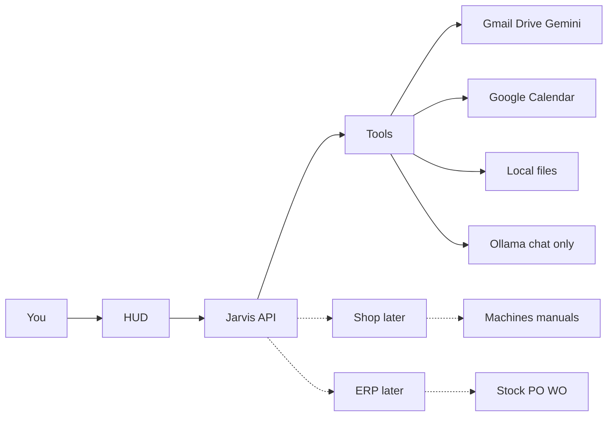

# Overall Jarvis plan

## What the PDF is saying (brief)

The PDF is an industry brief for a **CNC turning/milling shop-floor assistant**, not a chat toy. The assistant sits **in front of** ERP/MES/CMMS as a cognitive layer:

- **Glanceable, cited, short.** No fluff. Bounded conversationality (your HUD + speak layer already match this).
- **Do not flood alarms.** Diagnose, prepare a fix, ask a human. That is our **Shall I** rule, not a new personality.
- **HITL spectrum:** silent log for cycle times; supervisor override for process; **Shall I** for money and safety (POs, spindle rebuild).
- **Shop UI:** rugged tablet, glove-sized targets, high-contrast, sub-600ms voice, barge-in, Hinglish, noisy floor. Browser SpeechRecognition will not be enough there.
- **CNC capabilities (later):** CAM 80–90% + human review; tool-wear RUL; alarm codes from **your plant manuals**; CMMS work orders; auto-PO min/max; cycle-time quoting; QR-on-machine manuals; shift handover; CV QA with human scrap/rework.
- **SME advice:** pick **one pain** and prove it. Not factory-in-a-day.

It is **not** “build an ERP.” ERP is the books. Jarvis is the face.

## What we already have

Local HUD (`frontend/`) + FastAPI (`backend/`). Ollama only for ordinary chat. Work paths skip the model.

Proven: orb, wake word, Shall I, Gmail send/read, Drive, Task for Gemini + thread watch, tables on the board, last scene persist, demo mailbox/calendar, Excel/Word/PDF under `backend/exports`.

Still demo: **briefing** and **calendar** (`calendar_backend=local` in [backend/app/config.py](backend/app/config.py); [docs/AS_BUILT.md](docs/AS_BUILT.md)).

**Held:** larger Ollama, Electron, canvas↔HUD, LangChain, Lambda ERP merge.

## Architecture (does not change)

Jarvis owns voice, HUD, heuristics, and confirmations. External systems are **connectors**. ERP later is a **system of record** Jarvis calls — same pattern as Gmail — not a replacement HUD.

## North star vs next months

| Layer | Who | When |
| --- | --- | --- |
| Office HUD | You at the desk | Now — until it is trusted every morning |
| Shop-floor voice/tablet | CNC operators | After office is trusted; one pain, not the factory |
| ERP / MES / machines | Books and telemetry | Greenfield today. Add when there is a real shop and real books |

## Phase A — Office trust (this quarter)

Make the morning loop real so you stop using demo calendar.

1. **Live briefing + Google Calendar** on the existing OAuth (add Calendar scopes; briefing and glance read live events; create event still Shall I).
2. **Drive-first Gemini** polish if anything still snags (already mostly live).
3. **Remote use** (bind/host, not Electron) when you need the HUD off this PC.
4. **GitHub remote** when you have an empty private repo URL.

Success: “Brief me” and the idle whisper are **your** mail and **your** day, not Priya/Amit seeds.

## Phase B — Office depth (only if A is boring in a good way)

- Deeper mail (labels, attachments you can actually use).
- Docs as working set (open / cite / “that sheet”).
- Optional larger local model **after** VRAM exists — warmth only, never on send/calendar.
- Canvas stays a side surface until someone needs HUD↔canvas.

No LangChain. No ERP UI.

## Phase C — First shop slice (one pain)

Start **without** machines or ERP: **knowledge**, not telemetry.

Candidate first pain (pick one when a shop exists):

- Alarm-code Q&A from **that plant’s manuals** (PDF/QR), short cited answers on the HUD.
- Or shift handover card (what ran, what broke, what’s next) as a spoken briefing.

Shop voice (noise, Hinglish, barge-in) and rugged tablet layout come **with** this slice, not before. Browser STT is an office tool.

Still no ERP. Still no “connect every Fanuc.”

## Phase D — Machines (when a cell can talk)

MTConnect / OPC-UA (or vendor path) for **one** cell: status, alarm code, cycle. Jarvis **prepares** the diagnosis and a Shall I fix; it does not dump SCADA on the board.

CAM, tool-wear RUL, CV QA: after that cell is trusted.

## Phase E — ERP as backend (when there are books)

Introduce ERP (ERPNext or other) as **connectors**, same safety table:

| Free | Shall I |
| --- | --- |
| Stock on hand, WO status, cycle history | Create PO, change min/max, scrap, release WO |

Do **not** vendor [lambda-erp](https://github.com/lambdadevelopment/lambda-erp). Do **not** build GL/inventory screens inside Jarvis. The HUD stays the product; ERP stays the ledger.

## Safety (frozen)

Drafts and reads are free. **Send, calendar write, money, safety, machine write** need Shall I. Files stay under `backend/exports`. Secrets stay in `.env`.

## Immediate next implementation (after this plan is approved)

Not the whole roadmap — the next build:

- Extend Google OAuth with Calendar scopes.
- Live `list_calendar` / briefing / glance from Google when connected; local seed when not.
- Create event still Shall I, then Google write.
- Keep Gmail + Drive + Gemini as they are.

Shop floor and ERP stay documented intent, not tickets yet.
